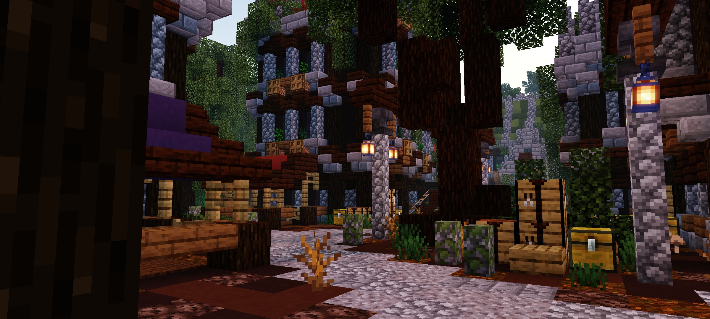

 

# NEWB VARIANTS
**Newb Variants** is a RenderDragon successor to the legacy GLSL shader, [Newb Shader](https://github.com/devendrn/newb-shader-mcbe). It is an enhanced vanilla shader that focuses on being lightweight and having soft aesthetics. It supports Minecraft Bedrock 1.21+ (Windows/Android/iOS).

> [!NOTE]
> This is a repository Newb Variants created by firmw4

 

## Downloads
[Stable Builds](https://github.com/firmw4/newb-x-mcbe/releases/tag/shaders) (All my stable variants)

Nightly builds for Android (ESSL), Windows (DX), and iOS (Metal) can also be found at the [Discord server](https://discord.gg/newb-community-844591537430069279).

 

## Installation

> [!NOTE]
> Shaders are not officially supported on Minecraft Bedrock. The following are unofficial ways to load shaders.

### Android
1. Install [Patched Minecraft App](https://devendrn.github.io/renderdragon-shaders/shaders/installation/android#using-patch-app)
2. Import the resource pack and activate it in global resources.

### Windows
1. Use [BetterRenderDragon](https://github.com/ddf8196/BetterRenderDragon) to enable MaterialBinLoader.
2. Import the resource pack and activate it in global resources.

### Linux / Mac
This method is for [mcpelauncher-manifest](https://mcpelauncher.readthedocs.io/en/latest/getting_started/index.html).
##### x86_64 arch
1. Install [mcpelauncher-materialbinloader-mod](https://github.com/CrackedMatter/mcpelauncher-materialbinloader).
2. Import the resource pack and activate it in global resources.  
##### x86_64, x86, arm64, arm arch
1. Download [mcpelauncher-shadersmod](https://github.com/GameParrot/mcpelauncher-shadersmod/releases/latest).
2. Follow this [guide](https://faizul726.github.io/guides/shadersmodinstallation) to setup.
